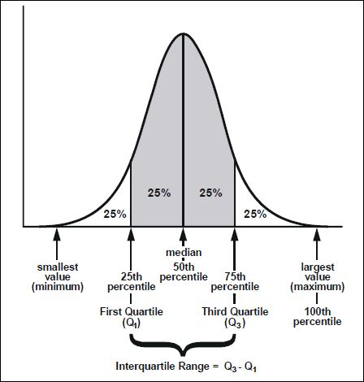

# Weather Station

## Tasks

### Task 1.1

Import the data set **MET Office Weather Data.csv** into Matlab. Do the following:

* Save the file locally on your computer
* Open the file
* Create a script for reading the data set and save this script
* To do this you must use the **`Import Data`** button
* Study the script and change the name of the Matlab variable created by the import to **`weatherD`**.
* Which Matlab function is used to read in the data?

### Task 1.2

Execute the created script. This creates the variable **`weatherD`** with the type Table. Run the **`summary`** command. What information from Summary is not helpful?

### Task 1.3

Add to your script so that a new variable **`wDfixed`** is created that contains only valid values. How many rows were removed from the table?

### Task 1.4

Extend your script so that your table is sorted by year and month and create a plot that shows the maximum temperature over the years. Why is the result not useful?

### Task 1.5

Which weather station provides the most data? Create a new table that contains only the data from this weather station.

### Task 1.6

Create a new table containing the average temperatures per year. Use the **`groupsummary(..)`** function and plot the average maximum temperatures since the beginning of the measurement. Use the **`mean`** function for the calculation.

### Task 1.7

Run the same analysis again. This time, however, use the **`median`** function and plot the progression on the same graph. Choose an appropriate marker to distinguish the two data series. Compare the data and comment. Does the graph meet your expectations?

### Task 1.8

Which is the measuring station with the largest average rainfall per year, and which is the measuring station with the smallest average rainfall per year.

### Task 1.9

Draw a scatterplot that contrasts the rainfall and temperature of a station. Label the plot with title, X-axis and Y-axis.

### Task 1.10

Compare maximum temperatures of these two measuring stations in a boxplot.

## Task 2

### Task 2.1

Umformen von Termen:

1. A &cup; (A &cap; B)
2. A &cap; (A &cup; B)
3. B \ (B &cup; C)
4. B \ (B &cap; C)
5. A &cup; (B \ (C &cap; A))
6. A \ ((B &cup; C) &cap; (A &cup; C))

### Task 2.2

We use the same data type (**`MET_Office_Weather_Data.csv`**). However, we only consider the data for the year 2020.

We use the calculation rules to select the records that lie within the 25% quartiles in terms of **`tmin`**.

1. Create subsets:
   1. construct the subset of the data of the year 2020 and hold this set in the variable data2020 (remove invalid values). 2.
   2. Form the subset aboveMedian, which contains all data, with tmin > median(tmin). Form the subset belowMedian, which contains all the data, with tmin <= median(tmin). 3.
   3. Repeat this procedure for these two subsets and define two new names for each of them.
2. Which weather stations have a tmin that is between the lower and upper quartile? - This should be 50% of all data sets. Check.
3. Write down the set operations you performed as a formula. 4.
4. What range does this quantity correspond to in a boxplot?

## Task 4

### Task 4.1

Read the data from the file "MET Office Weather Data .csv" in into the Matlab variable data.

### Task 4.2

Prepare this variable so that you can calculate with the data rain, sun, tmin, tmax.

### Task 4.3

Remove the column af from the data.

### Task 4.4

Determine the weather station that has the largest sum of precipitation per month (over the entire measurement period).

### Task 4.5

Determine the data set that only contains the annual data of the weather station determined.

### Task 4.6

Create a combined chart, with two sub-charts, one below the other. All diagrams refer to the data set.

### Task 4.7

The first sub-diagram should show the temperature curve from the beginning to the end of the measurement for the data median_tmin and median_tmax.  The diagram should have a title, axis labels and a legend.

### Task 4.8

The second subdiagram should show the sunshine duration (mdian_sun) and the mean rainfall (median_rain) over the entire measurement period. Attention: the sunshine duration and the rainfall have different units and must not be shown on the same y-axis! The diagram should have a title, axis labels and a legend.

## Contributing

This is a personal learning project for me. Please feel free to fork this repo. Pull request to submit more programs.

## Feedback

If you find any bug or have any suggestion, please do file issues. I am graceful for any feedback and will do my best to improve this package.

## License

[MIT](LICENSE) © 2020 Ioannis Christodoulakis
